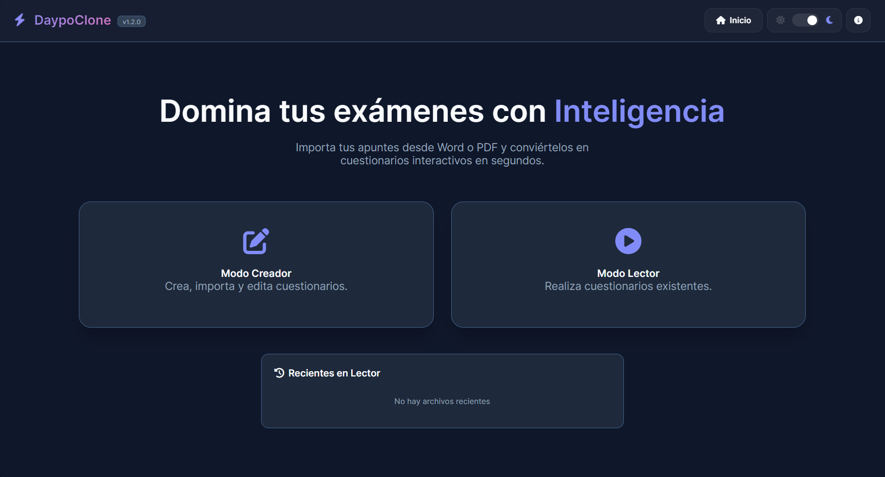

# Clon Daypo - Creador y Lector de Tests Interactivo

Bienvenido a **Clon Daypo**. Esta es una herramienta educativa gratuita, disenada para crear, estudiar y contestar examenes o tests de opcion multiple de una forma sencilla, rapida y sin necesidad de conocimientos tecnicos.

Este proyecto nacio con fines didacticos, apoyado en Inteligencia Artificial, y busca ofrecer una experiencia de estudio fluida manteniendo el procesamiento de tus documentos dentro del navegador.

---

## Que puedes hacer con esta herramienta

Clon Daypo se divide en dos modos principales: el **Modo Creador** para disenar tus examenes y el **Modo Lector** para poner a prueba tus conocimientos.

### 1. Modo Creador

- **Carga facil de documentos:** Sube apuntes en formato **TXT**, documento de Word (**DOCX**) o PDF (**PDF**).
- **Inteligencia artificial en tu navegador:** El sistema puede analizar el texto y ayudarte a detectar preguntas y opciones de respuesta. La primera vez puede descargar un modelo de IA en el navegador, mostrando una barra de progreso.
- **Navegacion intuitiva:** Mientras editas, tienes un panel lateral que baja contigo y resalta la pregunta en la que estas trabajando.
- **Exporta tus tests:** Guarda el cuestionario como un archivo **TXT** compatible con el Modo Lector.

### 2. Modo Lector

Sube tus tests guardados en archivos `.txt` y practica.

- **Ambiente libre de distracciones:** Resuelve las preguntas usando una interfaz limpia.
- **Mostrar u ocultar respuestas:** Puedes revelar la respuesta correcta para una pregunta o usar **Revelar Todos** como interruptor.
- **Panel de estadisticas:** Observa cuantas preguntas has respondido, aciertos y errores.
- **Lista de archivos recientes:** Desde el inicio puedes abrir rapidamente los ultimos 5 archivos cargados en modo lector.

---

## Privacidad y dependencias externas

El contenido de los documentos se lee y se procesa en tu navegador. La aplicacion usa dependencias externas desde CDN para librerias, iconos, analitica y el modelo de IA, por lo que requiere conexion a Internet para cargar ciertos recursos y no debe considerarse una aplicacion totalmente offline.

---

## Compatibilidad de dispositivos

Este sitio web no ha sido optimizado para telefonos moviles ni pantallas pequenas, por lo que no se garantiza el funcionamiento correcto de la interfaz en esos dispositivos. Se recomienda acceder desde un ordenador o una tablet.

---

## Como se utiliza

1. Abre la pagina principal.
2. Elige **Crear** o **Leer**.
3. Entra a **Crear** para generar o editar un cuestionario desde tus apuntes.
4. Entra a **Leer** para seleccionar un archivo `.txt` exportado y comenzar a practicar.

---

## Acerca del proyecto

Este proyecto es una creacion de **Firo**.

Para consultas, ideas o informacion adicional, puedes ponerte en contacto:
firogv96@outlook.com

Puedes revisar la version actual desde el boton **Acerca de** ubicado en la esquina superior derecha de la aplicacion.
